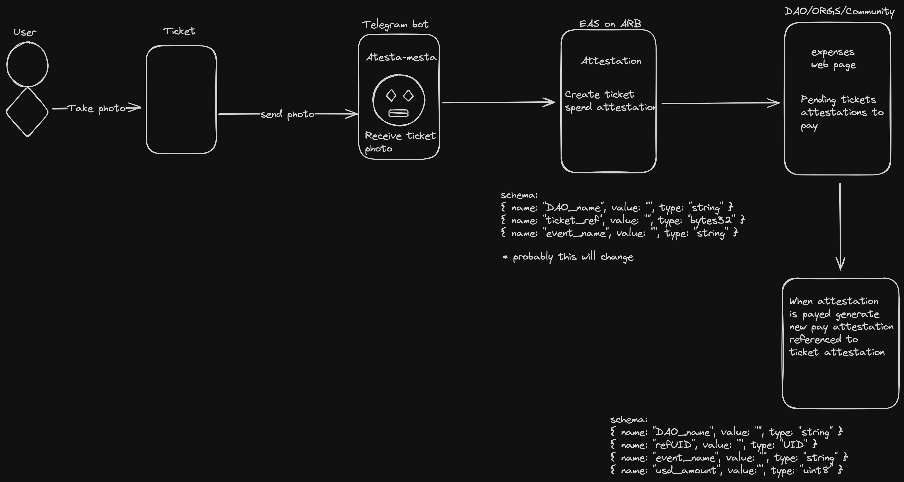
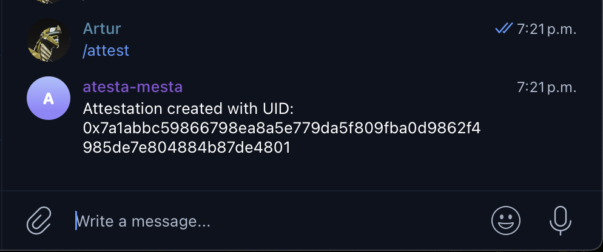
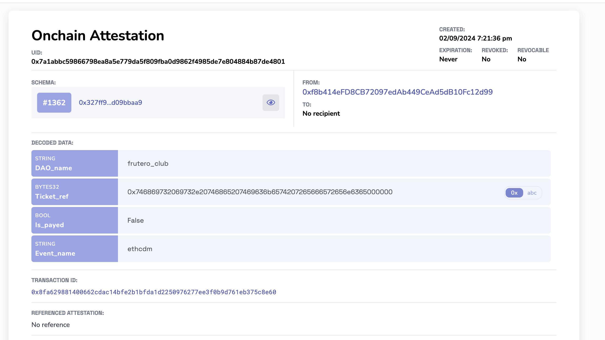

# ATESTA_MESTA TELEGRAM BOT

## Which problem We are solving?

Some entities like Daos use multi-signature wallets, and when their collaborators have off-chain expenses, it's harder to track and justify those expenses. Now, through the bot, we can create an attestation of that ticket with just a photo and in a user-friendly way.

### Tangible uses cases

* Attestation of DAO's Financial Resource Management.
  * Tracking offchain events (expenses).
  * Expenses review for DAO members.

## What does this bot do?

Create an attestation with EAS SDK for manage `Offchain Expenses Bills` for DAOs, Multisig, Communnities, or just for normal people. This bot prevents our users from publishing sensitive data by only requesting relevant information for the ticket attestation.

## How We do?

Tech Stack:

* NodeJS
* EAS SDK
* EthersJS
* Telegraph

### User flow

## Roadmap

1. Hardcoded MVP
2. Multichain Hardcoded MVP (Arbitrum, Optimism)
3. Frontend to get tickets pending to pay
4. Pay tickets and make attestations for payments refferences to corresponding bill
5. First Beta launch.

## First Testing

### Sending command `/attest` to bot

### EAS explorer

[Attestation onchain](https://sepolia.easscan.org/attestation/view/0x7a1abbc59866798ea8a5e779da5f809fba0d9862f4985de7e804884b87de4801)
